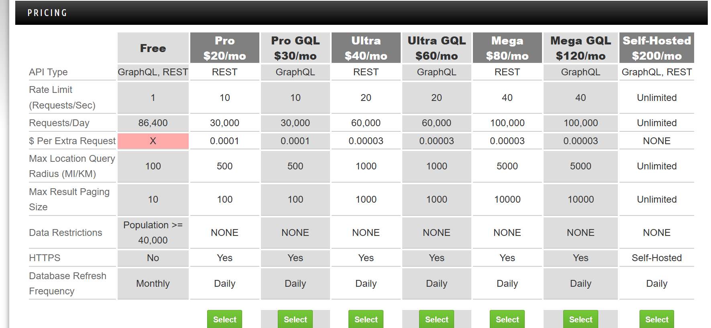
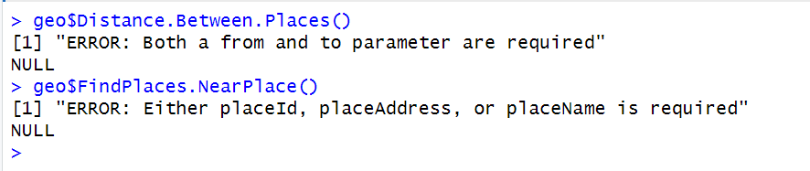

# Class Constructor Usage:
The GEO class provides the constructor "initialize" to setup a GEO db wrapper object. This can be created like:  
object <- GEO$new(api_key = "your api key", max_limit = your_plans_maximum_paging_limit)  
  
The parameters of api_key and max_limit both depend on your api usage plan. THe max limit is the maximum result paging size, this parameter sets the default for the limit param passed in all api wrapper functions (default is 10 which is the free plan). The api_key parameter is only required if you are using a pro plan and require an api key. If you are using the free plan then you do not require an api key and you do not pass the api_key parameter any value when calling the constructor. See the char below or the following link for more details:  
  
http://geodb-cities-api.wirefreethought.com/pricing
  

# Parameters
## namePrefix vs name:
Both of these parameters are optional.  
The namePrefix parameter will only be used (to find records matching by namePrefix) if the name parameter is null. In other words, if you provide a value for the name parameter then this parameter takes priority over the namePrefix parameter and the namePrefix parameter is then ignored. For example if you proivde name = "San" and namePrefix = "S" then only records with an exact matching name of San will be retrieved.  

## Conditionally required parameters example:

  
## placeName, placeId, and placeAddress (conditionally required)
Either a placeId, or a placeAddress, or a placeName is required.  
PlaceId is the dominant parameter and takes priority over the other 2. If placeId is passed a value then place Id is used for the query, and both placeAddress and placeName are ignored. If placeId is null then the best matching wikidataId for the placeAddress and placeName  used in combination is used to identify a place.
  
## locationAddress, longitude and latitude 
longitude and latitude are the dominant parameters and take priority for identifying a location over the locationAddress parameter. Both longitude and latitude need to be passed values to be used for identifying a place, otherwise locationAddress will be used (if locationAddress is not null). If none, or only one value is passed to only one of longitude or latitude then these 2 parameters are ignored, and location address is used.  
  
## countryId and country (conditionally required)
One of these is required (one must not be null)  
countryId takes priority over country, the country param is ignored if countryId is passed a value. The country param is only used if countryID is null.  
  
## regionId and region (conditionally required)
One of these parameters is required (at least one must not be null)  
regionId takes priority over region, the region param is ignored if regionId is passed a value. The region param is only used if regionId is null.  
  
## toId, toName and toAddress (Conditionally required)
Either a toId, or a toAddress, or a toName is required.  
toId is the dominant parameter and takes priority over the other 2. If toId is passed a value then toId is used for the query, and both toAddress and toName are ignored. If toId is null then the best matching wikidataId for the toAddress and toPlace is used in combination to identify a place.  
  
## fromId, fromName and fromAddress (Conditionally required)
Works the same as toId, toName and toAddress
